I'm Dmitry. Passionate about Microsoft services, Windows & PowerShell. Open-source enthusiast and maintainer. I do ❤️ automation.

<kbd>
	
</kbd>
<kbd>
	
</kbd>
<kbd>
	
</kbd>

Currently working on:

